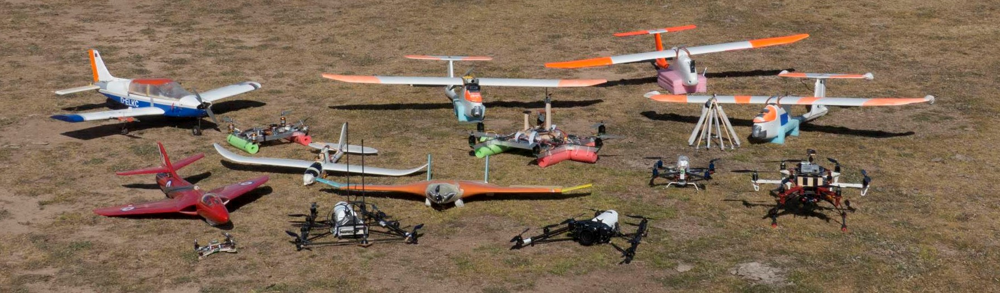

# uas_tools_index
The index page for a collection of tools, scripts and checklists developed for operating UAVs.

- Log Processing Tools
  - [kvis](https://github.com/flyingk/kVIS3)
    - An open source, MATLAB-based platform for UAV data analysis that features advanced signal processing,
filtering, spectrum analysis and automatic maneuver extraction. kvis currently supports ArduPilot and PX4
data files, with support for additional data files easily added using the examples provided.
  - [ardupilot_bin2csv](https://github.com/AndersonRayner/ardupilot_bin2csv)
    - Script for exporting ArduPilot bin logs to csv
  - [ulogReader](https://github.com/AndersonRayner/ulgReader)
    - A MATLAB script for importing ulog files  
- ROS Tools
  - [ardupilot_sitl_example](https://github.com/AndersonRayner/ardupilot_sitl_example)
    - An example setup for running the ArduPilot SITL simulator such that it can be used with ROS in a repeatable
manner across diff erent machines.
  - [ros_uav_interfacing](https://github.com/AndersonRayner/ros_uav_interfacing)
    - Scripts that demonstrate interfacing ROS with a UAV using MAVlink and mavros, including setting
low-latency connections and data stream rates.
  - [ros_uav_command](https://github.com/AndersonRayner/ros_uav_command)
    - Example scripts ROS scripts for commanding MAVlink-enabled UAVs via MAVlink.
- Misc
  - [arduino_mavlink](https://github.com/AndersonRayner/arduino_mavlink)
    - A library for providing examples of using a MAVlink connection with Arduino. This can be used to
communicate between an Arduino and MAVlink-based flight controller, and can also be used to share the
telemetry connection between the two.
  - [uas_templates](https://github.com/AndersonRayner/uas_templates)
    - A collection of templates for checklists, flight logging, etc. that have been found to be useful when planning
field trips.
  - [udev_rules](https://github.com/AndersonRayner/udev_rules)
    - udev rules allow the operating system to assign consistent names to ports on the computer, so that the device on ttyUSB0 is always the same device. 

This repo accompanies the paper

Matthew Anderson, Kai Lehmkuehler, Jeremy Randle, K.C. Wong and Soon-Jo Chung, "[UAS Flight Testing in Support of Research for Academia: Lessons and Experiences from the Field](paper/Flight_Testing_in_Academia.pdf)," AIAA SciTech Forum 2023, National Harbor, MD, January 2023.
